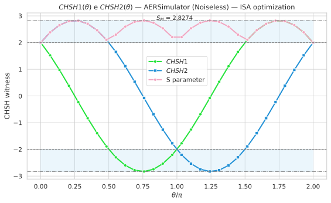
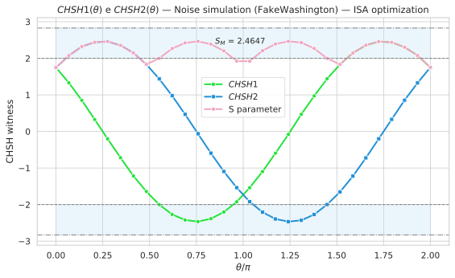
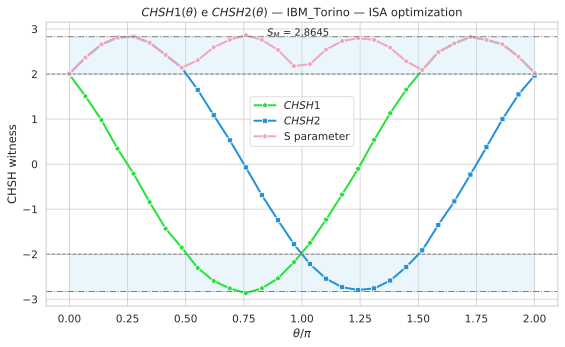
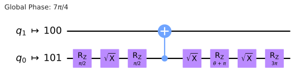
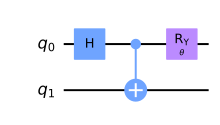
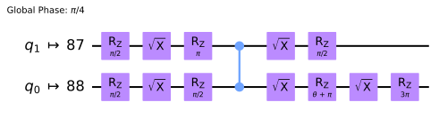

# CHSH Bell S-Parameter Test

[](LICENSE)


**Bell-CHSH benchmark with Qiskit: ideal simulation, device-inspired noise and IBM quantum hardware.**

This repository implements a reproducible CHSH Bell-inequality test on the maximally entangled Bell state $|\Phi^+\rangle$. The same measurement workflow is compared across three execution environments:

- **Ideal Aer simulator** — noiseless reference benchmark
- **FakeWashington noise model** — device-inspired noisy simulation
- **IBM quantum hardware** — real-backend execution through Qiskit Runtime

The goal is to estimate the CHSH witness/S-parameter and compare the observed violation with the classical Bell bound $|S| \leq 2$ and the ideal quantum value $2\sqrt{2}$.

## ✨ Key Features

- 🧩 Bell-state preparation of $|\Phi^+\rangle$
- 🔁 Parametrized measurement circuit for CHSH-angle scans
- 🧪 Ideal Aer simulation and FakeWashington noisy simulation
- ⚛️ IBM quantum hardware execution workflow
- 📊 Saved CHSH-witness plots for all backends
- 🔌 Saved parametrized and ISA-optimized circuits

## 🗂️ Directory Structure

```text
Notebook/
  Simulations/      Ideal Aer and FakeWashington simulation notebook
  Real/             IBM quantum hardware notebook
Results/
  Plots/            CHSH witness curves
  Circuits/         Parametrized and ISA-optimized circuits
requirements.txt    Python/Qiskit dependencies
LICENSE             MIT license
README.md           Project overview
````

## 🚀 Quick Start

### Clone the repository

```bash
git clone https://github.com/Phoeredor/Bell-CHSH-S-Parameter.git
cd Bell-CHSH-S-Parameter
```

### Create and activate a virtual environment

```bash
python3 -m venv .venv

# macOS / Linux
source .venv/bin/activate

# Windows PowerShell
# .\.venv\Scripts\Activate.ps1
```

### Install requirements

```bash
pip install -r requirements.txt
```

### Run the notebooks

<details>
<summary><b>Ideal Aer simulator and FakeWashington noise model</b></summary>

```bash
jupyter lab Notebook/Simulations/AER_Simulation_CHSH.ipynb
```

</details>

<details>
<summary><b>IBM quantum hardware</b></summary>

```bash
jupyter lab Notebook/Real/Real_Hardware_Simulation_CHSH.ipynb
```

The real-hardware notebook requires access to IBM Quantum services through `qiskit-ibm-runtime`.

</details>

## 📈 Results

The table summarizes the maximum CHSH value found in each scan and the mean value across the sampled angles.

|           Backend          | S<sub>max</sub> |    Mean ± σ   | Comment                                                                           |
| :------------------------: | :-------------: | :-----------: | :-------------------------------------------------------------------------------- |
|     Ideal Aer simulator    |      2.8274     | 2.528 ± 0.269 | Noiseless reference, close to $2\sqrt{2}$                                         |
| FakeWashington noise model |      2.4647     | 2.204 ± 0.234 | Bell violation survives, but the witness is reduced by noise                      |
|    IBM quantum hardware    |      2.8645     | 2.525 ± 0.266 | Raw hardware estimate; interpret with the full curve and finite-shot fluctuations |

All generated figures and circuits are stored in [`Results/`](Results/).

## 🖼️ Plots and Circuits

<details>
<summary><b>CHSH witness plots</b></summary>
<br>

|                                                                                 Ideal Aer simulator                                                                                 |
| :---------------------------------------------------------------------------------------------------------------------------------------------------------------------------------: |
| <br><em>Noiseless CHSH benchmark on the Aer simulator.</em> |

|                                                                                          FakeWashington noise model                                                                                         |
| :---------------------------------------------------------------------------------------------------------------------------------------------------------------------------------------------------------: |
| <br><em>Device-inspired noisy simulation using the FakeWashington noise model.</em> |

|                                                                                      IBM quantum hardware                                                                                      |
| :--------------------------------------------------------------------------------------------------------------------------------------------------------------------------------------------: |
| <br><em>CHSH witness estimated from real IBM quantum hardware data.</em> |

</details>

<details>
<summary><b>Quantum circuits</b></summary>
<br>

|                                                                                       Aer simulator circuit                                                                                       |
| :-----------------------------------------------------------------------------------------------------------------------------------------------------------------------------------------------: |
| <br><em>Parametrized and ISA-optimized circuit used for the Aer workflow.</em> |

|                                                                    FakeWashington parametrized circuit                                                                   |                                                                         FakeWashington ISA-optimized circuit                                                                         |
| :----------------------------------------------------------------------------------------------------------------------------------------------------------------------: | :----------------------------------------------------------------------------------------------------------------------------------------------------------------------------------: |
| <br><em>Parametrized circuit before backend optimization.</em> | <br><em>ISA-optimized circuit for the FakeWashington backend model.</em> |

|                                                                         Real-hardware parametrized circuit                                                                         |                                                                             Real-hardware ISA-optimized circuit                                                                            |
| :--------------------------------------------------------------------------------------------------------------------------------------------------------------------------------: | :----------------------------------------------------------------------------------------------------------------------------------------------------------------------------------------: |
| <br><em>Parametrized circuit before backend-aware transpilation.</em> | <br><em>ISA-optimized circuit used for IBM quantum hardware execution.</em> |

</details>

## 📚 Reference

* Base circuits and measurement scheme adapted from the [IBM Quantum CHSH inequality tutorial](https://learning.quantum.ibm.com/tutorial/chsh-inequality).

## 🤝 Acknowledgments

* Portions of the code were developed with assistance from [ChatGPT](https://openai.com/index/chatgpt/).

## 📄 License

This project is distributed under the [MIT License](LICENSE).


